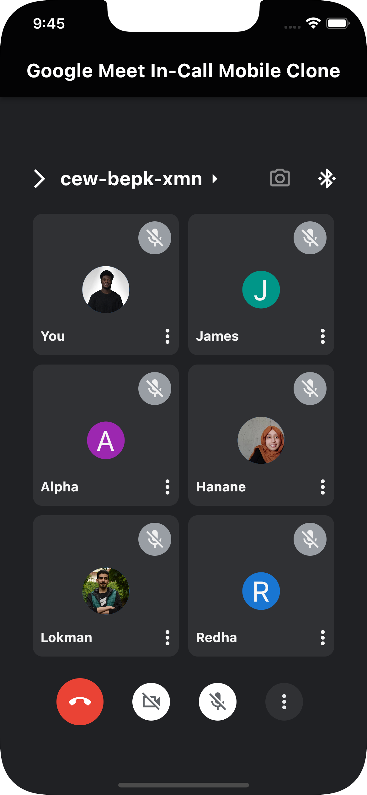

# Day 19

Today, I learnt,

- Customising Widgets with Themes.
- Composition in Flutter: Building Fluter Widgets From Scratch.

I built a Google Meet In-Call Mobile Interface App.

I was on a Google Meet call yesterday, during the process of the call, I got inspired by how the Interface of the Google Meet Mobile Interface looked, and decided to clone it.

Below is the App Preview: 

## Source Code

Find full source code [here](https://github.com/PiusSunday/google_meet_mobile_interface_clone)
