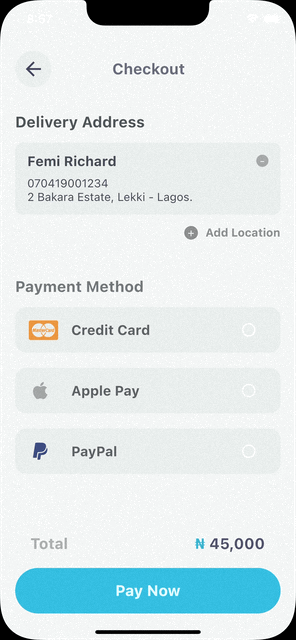

# Day 25

- Today, I completed the building of the Payment Checkout UI.

This is a payment checkout UI App, I got inspired from a design I saw on Twitter and decided to remake it and make it more interactive by allowing the user select what payment method they want to prefer.

Building this UI, I faced some difficulty when I was trying to Customize the Radio Button for each method. After many tries and watching some tutorials, I was able to get it to work.

- I also tried to add Images as Icons to an Application. I'm yet to achieve that since I'm trying to add this image as an Icon to the icon property of the IconStepper Widget from the IM_Stepper flutter package.

I'll do some more research and see if it's possible to add Images as Icons to the icon property of the IconStepper Widget from the IM_Stepper flutter package.

Full Source Code: 
