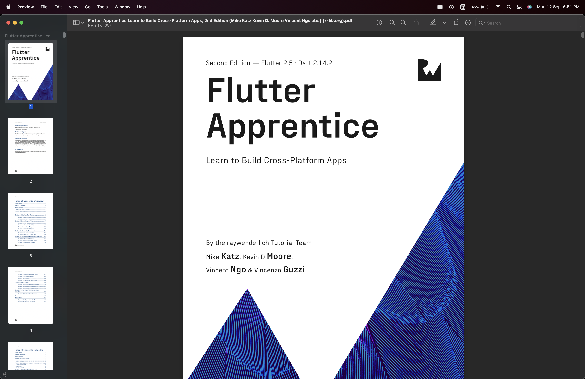

# Day 43

-- Today, I continued reading the Flutter Apprentice Book from Ray Wenderlich on how to build Cross-Platform Flutter Apps.

I like how the book is structured, it's very easy to follow and understand, and it's very detailed.

Every line of code is explained, with proper explanations and examples.

-- I'm currently on Chapter 3.

Link to the book: [Flutter Apprentice](https://b-ok.africa/book/17504413/4d49bf/?wrongHash)

Image of the book: 
