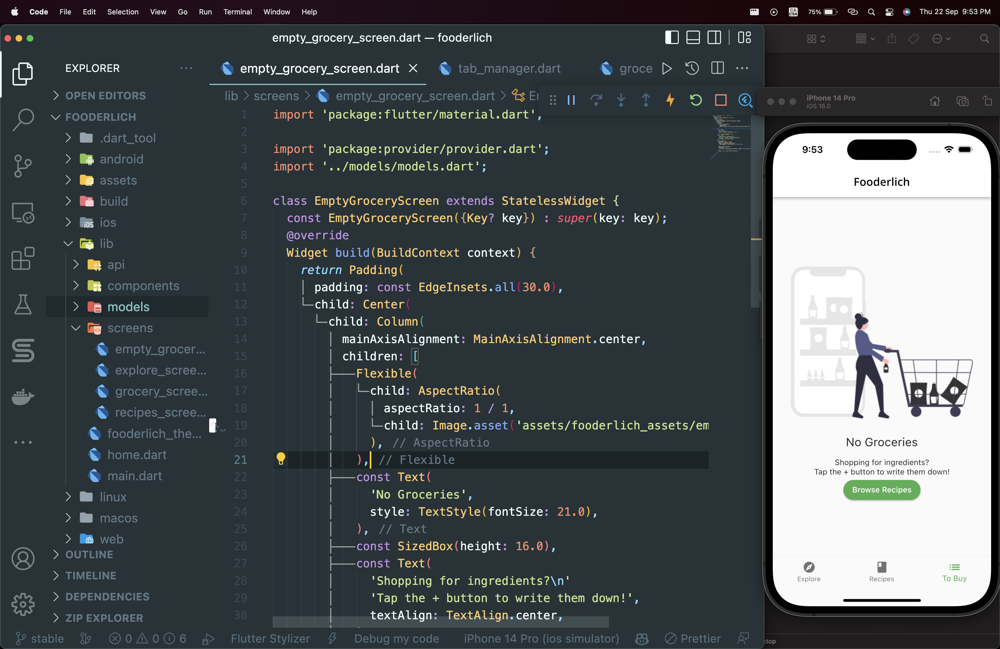

# Day 53

Today, I worked on the Recipes Screen and Currently working on the Grocery Screen.

I learnt,

- how to capture lots of data with scrollable widgets like ListView and GridView widgets.

- Currently learning about the introduction to Provider package, a package that helps you manage state and notify components that there’s updated data to display.

