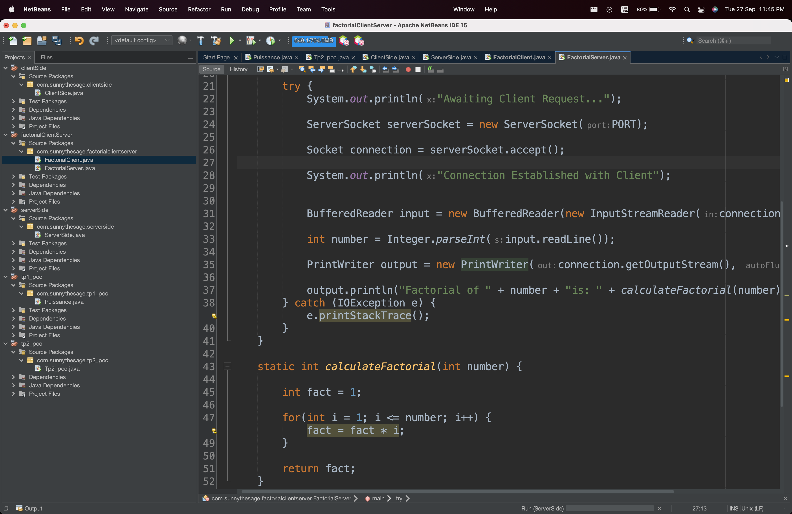

# Day 58

Today, I did some school work, where I had to learn and implement Java Socket Programming.

I learnt the following:

- About the Client/Server Architecture, and how to implement a simple client and server using Java.

- How to create a server socket.

- How to create a client socket.

- How to send and receive data from the server.

- Doing complex operations on the server and sending the result back to the client.

